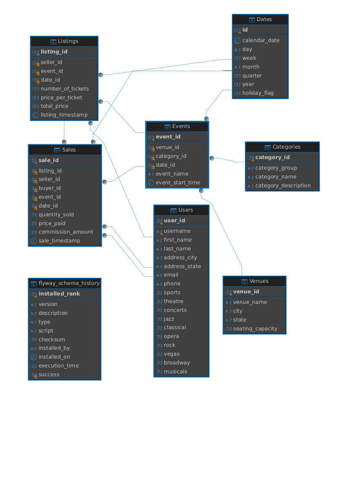

# Documentação do Processo de Desenvolvimento

Este documento visa garantir que todos os passos do processo de desenvolvimento estejam bem documentados para facilitar a manutenção e a continuidade do projeto.

---

### Inicialização do Projeto

- **Plataforma**: O projeto foi inicializado utilizando a plataforma [Spring Initializr](https://start.spring.io).

---

### ASDF

Para garantir que o sistema se mantenha executando nas versões adequadas, foi implementado o **ASDF** para a gestão das versões do Gradle e do Java. As versões podem ser vistas no arquivo `.tool_versions`.

---

### Bibliotecas Incluídas

- **Spring Web**: Para criar o projeto web e os endpoints RESTful.
- **Spring Data JPA**: Para mapear as entidades com o banco de dados.
- **Flyway Migration**: Para gerenciar as migrações de banco de dados.
- **MySQL Driver**: Para conectar com o banco de dados MySQL.
- **Spring Boot DevTools**: Para facilitar o desenvolvimento.
- **Spring Boot Test**: Para realizar os testes com JUnit.
- **Springdoc Openapi Starter Webmvc UI**: Para documentar a api.

---

### Docker Compose para o Uso do MySQL

Ao executar o comando `docker-compose up -d`, o MySQL 8.0 será configurado para rodar corretamente e com a criação automática da base de dados necessária para as migrações.

Recomenda-se utilizar este container, pois para que a aplicação execute as migrações de dados corretamente, é necessário que os dados da pasta `data` no teste estejam em `/var/lib/mysql-files/data`. O mapeamento e configuração dessa pasta estão inclusos no `docker-compose`.

---

### Motivo de Optar por este Método de População no Banco de Dados

Existem algumas maneiras para se popular o banco a partir de um arquivo txt, eu poderia por meio de uma script python reescrever meu arquivo `.txt` para `.sql`
ou poderia utilizar uma própria classe do java fazendo conexão direta ao JDBC Template ou utilizar o Driver Manager para fazer a conexão de forma direta usando
a url, usuário e senha do banco, mas em ambos os casos não atenderia o requisito de se utilizar um arquivo `V2` do flyway e devido a este método ser o melhor
que encontrei em minhas pesquisas optei por ele.

---

### Execução

Para simplificação, preparei um arquivo `launch.json` para usuários de **VSCode**, permitindo que os pacotes da aplicação sejam compilados e executados pelo debugger do VSCode, facilitando o processo de debug. Caso não deseje usar dessa forma, a aplicação pode ser executada com o seguinte comando:

```bash
./gradlew bootRun
```

---

### Abstrações

- Evitei abstrações para garantir que o sistema, a longo prazo, possa sofrer alterações relacionadas a cada regra de negócio específica. Portanto, não criei nenhum tipo de `AbstractService` ou `AbstractController`. Devido a essa escolha, foi necessário repetir código, mas isso garante uma boa manutenção a longo prazo.

---

### Paginação

- Devido ao grande volume de dados, percebi a importância de uma boa implementação de paginação. Por isso, implementei uma paginação baseada no `Pageable`. Não implementei buscas não paginadas, pois, para as regras de negócio que planejei, isso não faria sentido.

---

### Testes

- Utilizei o `SpringBootTest` junto com o `Mockito` para realizar todos os testes dos métodos `getById` e `getAll` da aplicação. Todos os dados utilizados nos testes foram fictícios, simulados com `Mockito`, garantindo que qualquer ambiente que execute o teste possa validar se a aplicação está funcionando corretamente, sem alterar o banco de dados.
- Para garantir que os testes abranjam vários cenários, realizei os primeiros testes após o desenvolvimento da primeira versão. Após isso, apliquei a metodologia **TDD** para a inclusão da paginação nos controllers.

---

### Promoções

- As promoções foram implementadas utilizando `Listings`, com base em eventos na data atual ou em datas futuras, que ainda não tenham esgotado todos os ingressos disponíveis. A quantidade de promoções foi limitada a 10, conforme solicitado.

---

### Variáveis de Ambiente

- Para garantir flexibilidade e facilidade de configuração, implementei 3 variáveis de ambiente: `DB_URL`, `DB_USERNAME`, `DB_PASSWORD`.

---

### Documentação

- Para facilitar a usabilidade, criei uma coleção de requisições no Insomnia e implementei o Swagger na aplicação, disponível na rota `/swagger-ui/index.html`.

---

### Git Workflow


---

### Diagrama de banco de dados



---

### Etapas Concluídas

- **(Concluído)** Projetei um esquema normalizado e criei um script MySQL DDL correspondente.
- **(Concluído)** Preparei a migração `v1` versionada com Flyway, encapsulando o script DDL de criação de esquema.
- **(Concluído)** Preparei uma migração `v2` com Flyway, que preenche o banco de dados com os dados exportados fornecidos no diretório de dados.
- **(Pendente)** Criação de um build do Gradle que invoca o Flyway e executa suas migrações.
- **(Concluído)** Adicionei o wrapper Gradle e o enviei para o repositório de origem.
- **(Concluído)** Realizei a criação das entidades que representam as tabelas geradas na etapa anterior.
- **(Concluído)** Usei `JPA` para criar os repositórios das tabelas/entidades.
- **(Concluído)** Para facilitar a revisão, enviei o código-fonte gerado para o repositório de origem.
- **(Concluído)** Expondi dois endpoints RESTful somente leitura para cada uma das entidades criadas nas Partes 1 e 2.
- **(Concluído)** Escrevi testes JUnit para exercitar e validar os métodos do serviço.
- **(Concluído)** Implementei um endpoint de serviço web que recebe três parâmetros como entrada:
  - Data de contexto (obrigatório)
  - ID da categoria do evento (opcional)
  - Cidade do evento (opcional)
- **(Concluído)** Implementei testes JUnit para exercitar e validar a implementação.
